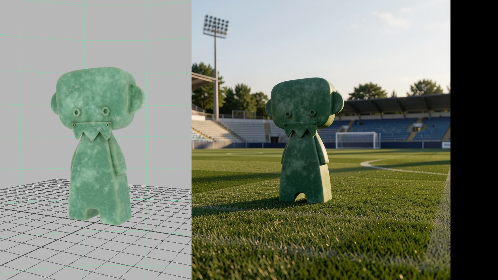
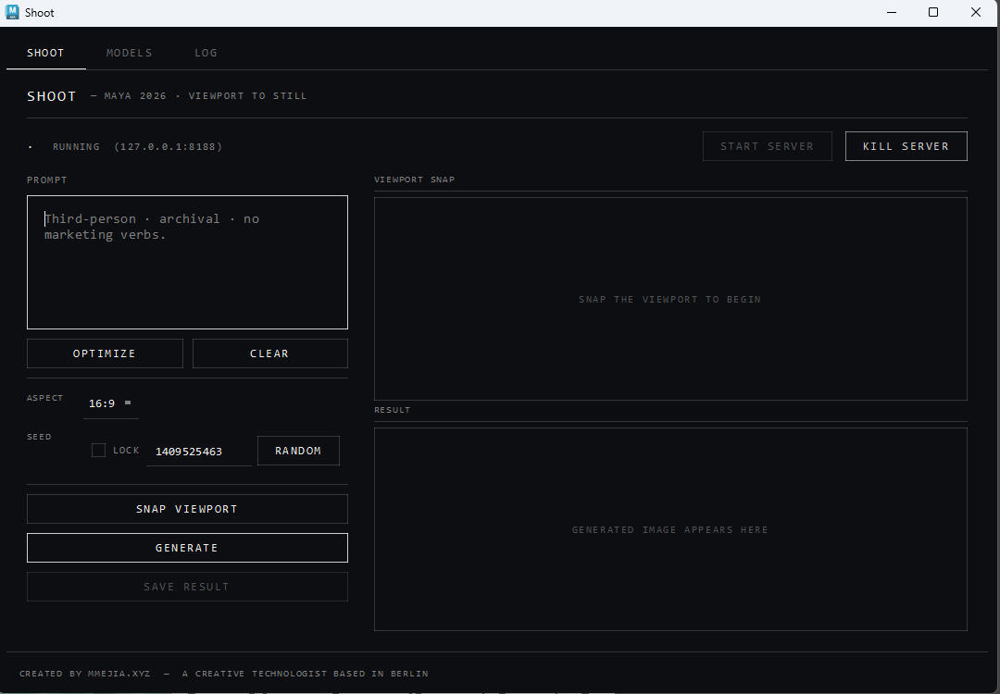
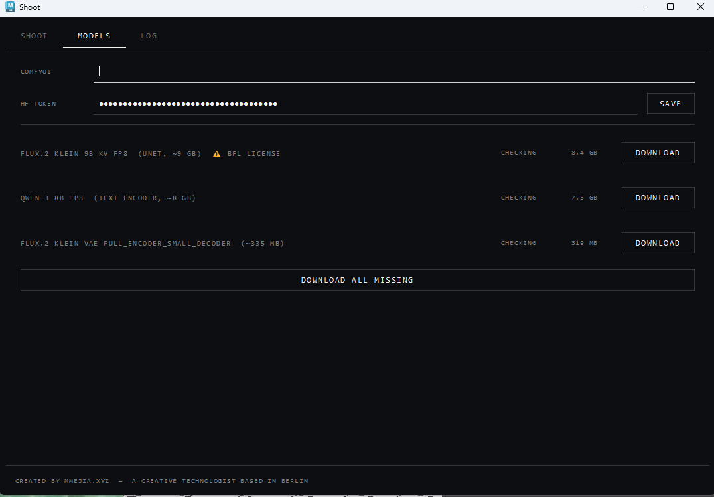
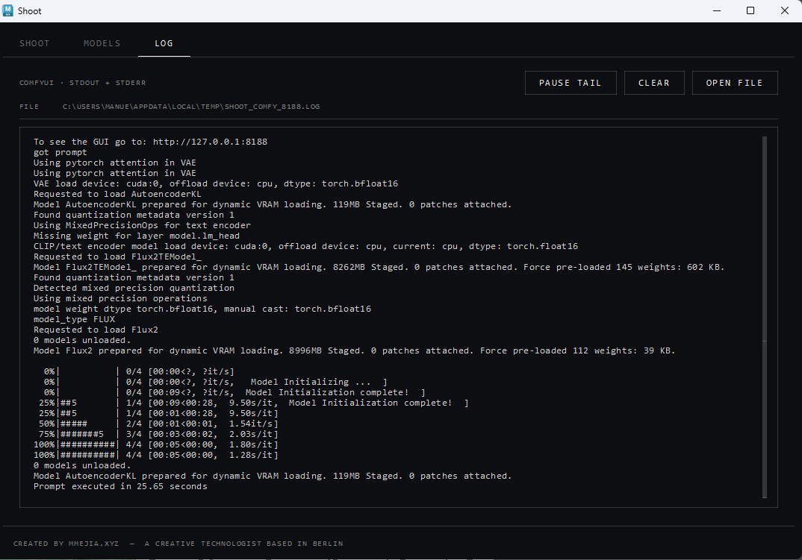

# Shoot

Autodesk Maya 2026 plugin that sends the active viewport to a local
ComfyUI server running FLUX.2 Klein 9B Distilled, and displays the
generated image in a docked panel.


- **Maya:** 2026 (PySide6, Python 3.11)
- **Backend:** ComfyUI (local, HTTP on `127.0.0.1:8188`)
- **Model:** FLUX.2 Klein 9B Distilled FP8 + Qwen 3 8B text encoder
- **Platform:** Windows 11, CUDA. Tested on a 12 GB GPU.
- **Docs:** https://mmejiaxyz.github.io/3DtoAI-Maya/

---

## Example

The viewport snap on the left, the generated still on the right. The
plugin uses the snap as a reference and the prompt to describe the new
environment; the character's silhouette and material are preserved.



---

## Requirements

| Component   | Version / Notes                                                    |
|-------------|--------------------------------------------------------------------|
| Maya        | 2026 (the plugin uses the `maya.api` 2.0 API and PySide6)          |
| Python      | mayapy — bundled with Maya 2026 (3.11)                             |
| ComfyUI     | Any recent build with FLUX.2 nodes (`Flux2Scheduler`, `EmptyFlux2LatentImage`, `ReferenceLatent`, `CFGGuider`) |
| Disk        | ~18 GB for the three model files                                   |
| GPU         | NVIDIA, 12 GB VRAM minimum recommended                             |
| HF token    | Required only for the gated FLUX.2 Klein UNet                      |

---

## Install

### 1. Clone into Maya's modules directory

```sh
git clone https://github.com/mmejiaxyz/3DtoAI-Maya.git ^
  "%USERPROFILE%\Documents\maya\2026\modules\shoot"
```

The repo contains a `shoot.mod` module file at the root, which adds
`shoot/` to `MAYA_PLUG_IN_PATH` and the Python path.

### 2. Install `huggingface_hub` into mayapy

```sh
"C:\Program Files\Autodesk\Maya2026\bin\mayapy.exe" -m pip install ^
  "huggingface_hub>=0.20"
```

Only needed for the in-panel model downloader. If you copy weights in
manually, this step can be skipped.

### 3. Install ComfyUI separately

Shoot does not bundle ComfyUI. Default expected install path is
`%USERPROFILE%\ComfyUI`; change it in the **Models** tab of the panel
if you installed it elsewhere.

### 4. Load the plugin in Maya

In the Plug-in Manager, load `plugin.py`. Or from the Script Editor:

```python
import maya.cmds as cmds
cmds.loadPlugin("plugin.py")
cmds.shootOpen()
```

The plugin registers a `shootOpen` command and a **Shoot** menu in
Maya's main menu bar.

---

## Models

| Key            | Filename                                       | Size     | HF repo                                                    | Gated |
|----------------|------------------------------------------------|----------|------------------------------------------------------------|-------|
| `unet`         | `flux-2-klein-9b-kv-fp8.safetensors`           | ~9 GB    | `black-forest-labs/FLUX.2-klein-9b-kv-fp8`                 | yes   |
| `text_encoder` | `qwen_3_8b_fp8mixed.safetensors`               | ~8 GB    | `Comfy-Org/vae-text-encorder-for-flux-klein-9b`            | no    |
| `vae`          | `full_encoder_small_decoder.safetensors`       | ~335 MB  | `Comfy-Org/vae-text-encorder-for-flux-klein-9b`            | no    |

Files go to `<comfy_dir>/models/diffusion_models/`,
`<comfy_dir>/models/text_encoders/`, and `<comfy_dir>/models/vae/`
respectively. The **Models** tab in the panel downloads all three with
resume support via `huggingface_hub`.

For the gated UNet, accept the license at
[huggingface.co/black-forest-labs/FLUX.2-klein-9b-kv-fp8](https://huggingface.co/black-forest-labs/FLUX.2-klein-9b-kv-fp8)
and paste a read-scoped HF access token into the **HF Token** field.

---

## Usage

1. Open the Shoot panel (`Shoot → Open Shoot Panel`).
2. **Models** tab: confirm the ComfyUI path, download missing models.
3. **Shoot** tab: click **Start Server** to launch ComfyUI as a subprocess.
   Wait for the status dot to brighten.
4. Frame the camera in Maya's viewport.
5. Click **Snap Viewport**. The PNG appears in the *Viewport Snap* pane.
6. Type a prompt. Adjust **Aspect** and **Seed** if needed.
7. Click **Generate**. Klein runs in 4 sampling steps at `cfg=1`; on a
   12 GB card, expect ~40 s end-to-end.
8. **Save Result** writes the PNG to disk.

### The panel

Three tabs — **Shoot**, **Models**, and **Log**. Strictly monochromatic,
monospaced, hairline-ruled.

| Shoot | Models | Log |
|:-----:|:------:|:---:|
|  |  |  |
| Prompt, aspect, seed, snap, generate. | Configure ComfyUI path and HF token, download the three FLUX.2 weights. | Live tail of `%TEMP%\shoot_comfy_<port>.log` — ComfyUI's stdout and stderr as it runs. |

### Kill Server

Always enabled when something is listening on port 8188. Works:

- During an in-flight generation (the polling task fails on the next
  `/history` request and the busy state clears).
- Against ComfyUI processes Shoot did not start — the manager falls
  back to `netstat -ano` (Windows) / `lsof` (Unix) to find the PID by
  port.

---

## Settings

Settings are read from environment variables first
(`SHOOT_<KEY>`), then Maya `optionVar`. The relevant keys:

| optionVar / env                  | Default                                       |
|----------------------------------|-----------------------------------------------|
| `shoot_comfy_dir` / `SHOOT_COMFY_DIR` | `%USERPROFILE%\ComfyUI`                  |
| `shoot_comfy_host` / `SHOOT_COMFY_HOST` | `127.0.0.1`                            |
| `shoot_comfy_port` / `SHOOT_COMFY_PORT` | `8188`                                 |
| `shoot_comfy_model_unet`         | `flux-2-klein-9b-fp8.safetensors`             |
| `shoot_comfy_model_text_encoder` | `qwen_3_8b_fp8mixed.safetensors`              |
| `shoot_comfy_model_vae`          | `full_encoder_small_decoder.safetensors`      |
| `shoot_comfy_steps` / `SHOOT_COMFY_STEPS` | `4`                                  |
| `shoot_comfy_guidance` / `SHOOT_COMFY_GUIDANCE` | `1.0`                          |
| `shoot_hf_token`                 | (none — required for gated UNet)              |
| `shoot_prompt`, `shoot_seed`, `shoot_lock_seed` | persisted from panel state     |

---

## Architecture

| Path                          | Role                                                                                          |
|-------------------------------|-----------------------------------------------------------------------------------------------|
| `shoot/plugin.py`             | Maya 2.0 API plugin shell. Registers `shootOpen` and a deferred-build menu item.              |
| `shoot/capture/viewport.py`   | `snapshot_active_view()` — reads the `M3dView` back buffer via `MImage`. Falls back to a single-frame `cmds.playblast` on driver refusal. Defensive `_active_model_panel()` for Maya 2026 panel-focus quirks. |
| `shoot/comfy/client.py`       | REST client over `urllib`. `upload_image`, `queue_prompt`, `wait_for_image` with `/history` polling and a 30-min default timeout. No third-party HTTP deps. |
| `shoot/comfy/manager.py`      | Lifecycle for the local ComfyUI subprocess. `start`, `start_and_wait`, `stop`, `kill`. Hides the console on Windows via `STARTUPINFO`. `kill()` falls back to PID-by-port lookup so externally-started servers can still be terminated. |
| `shoot/comfy/workflow.py`     | `build_flux2_workflow()` returns the FLUX.2 Klein workflow as a Python dict matching the official subgraph: 19 nodes, `ConditioningZeroOut` for negative, `EmptyFlux2LatentImage`, `Flux2Scheduler`, Euler sampler, `cfg=1`, 4 steps. |
| `shoot/comfy/downloader.py`   | `huggingface_hub` wrapper with a staging dir, byte-level progress polling on a background thread, and resume on `urllib` fallback URLs. |
| `shoot/inference/comfy.py`    | `generate(req, status_cb)` — uploads the reference, queues the workflow, polls, returns the PNG bytes. |
| `shoot/ui/shoot_panel.py`     | PySide6 panel with two tabs (Shoot, Models) on a `QThreadPool`. Maya commands that need the main thread (viewport capture, `getPanel`) run synchronously. |
| `shoot/settings.py`           | `get_setting(key, default)` reads env then `optionVar`. `get_comfy_dir()` is separate.        |

### Threading

ComfyUI calls run on `QThreadPool` workers; their status / result /
failed signals marshal back to the main thread. Anything that touches
`cmds.*` runs on the main thread directly — `cmds.getPanel(withFocus=True)`
in particular raises `"Flag withFocus must be passed a boolean argument"`
when called off-thread, despite the literal `True` being a boolean.

### Workflow node graph

```
LoadImage → ImageScaleToTotalPixels → GetImageSize
                                    ↘ VAEEncode ──→ ReferenceLatent (positive)
                                                  ↘ ReferenceLatent (negative)
CLIPTextEncode → ConditioningZeroOut → ReferenceLatent (negative)
              ↘ ReferenceLatent (positive)
                                      ↘ CFGGuider (cfg=1)
EmptyFlux2LatentImage + Flux2Scheduler + KSamplerSelect(euler) + RandomNoise
                                      → SamplerCustomAdvanced → VAEDecode → SaveImage
```

Reference scale target is 1 megapixel (`ImageScaleToTotalPixels` with
`megapixels: 1`). Output dimensions are derived from `GetImageSize` on
the scaled reference, so aspect follows the snap.

---

## Troubleshooting

**`cmds.loadPlugin("plugin.py")` fails with "not found on MAYA_PLUG_IN_PATH"**
The module file `shoot.mod` must be in a directory Maya scans. Default:
`%USERPROFILE%\Documents\maya\2026\modules\`. Restart Maya after
placing the module.

**Plugin loads but UI is stale after editing files**
Maya caches imported Python modules. Reload from the Script Editor:

```python
import sys, maya.cmds as cmds
for name in list(sys.modules):
    if name.startswith("shoot"):
        del sys.modules[name]
if cmds.pluginInfo("plugin", q=True, loaded=True):
    cmds.unloadPlugin("plugin")
cmds.loadPlugin("plugin")
cmds.shootOpen()
```

The panel prints `[shoot.ui.shoot_panel] loaded vN-...` on import — use
that to confirm which version is live.

**`"Flag withFocus must be passed a boolean argument"` during capture**
Means a Maya command was called from a background thread. All capture
code runs on the main thread now; if you see this, a custom workflow
is calling `snapshot_active_view()` or `get_viewport_angle()` from a
`QRunnable`.

**ComfyUI: `KSampler` error / model not found**
Verify the three model files exist at the paths in the **Models** tab.
The filenames must match exactly — the workflow references them by
filename. Override defaults via `SHOOT_COMFY_MODEL_UNET` etc.

**Stuck Comfy process Shoot can't see**
The **Kill Server** button falls back to port-PID lookup. If that also
fails:

```powershell
Get-NetTCPConnection -LocalPort 8188 -State Listen `
  | ForEach-Object { Stop-Process -Id $_.OwningProcess -Force }
```

---

## Limitations

- No multi-angle / orbit context. Earlier versions had this; the
  results were inconsistent so it was removed.
- FLUX.2 Klein is distilled. LoRAs trained for the full-step FLUX.2
  release are not guaranteed to work — none are wired in.
- Tested only on Windows 11 + CUDA. macOS / Linux paths are coded for
  but unverified.

---

Created by [mmejia.xyz](https://mmejia.xyz) — a creative technologist
based in Berlin.
